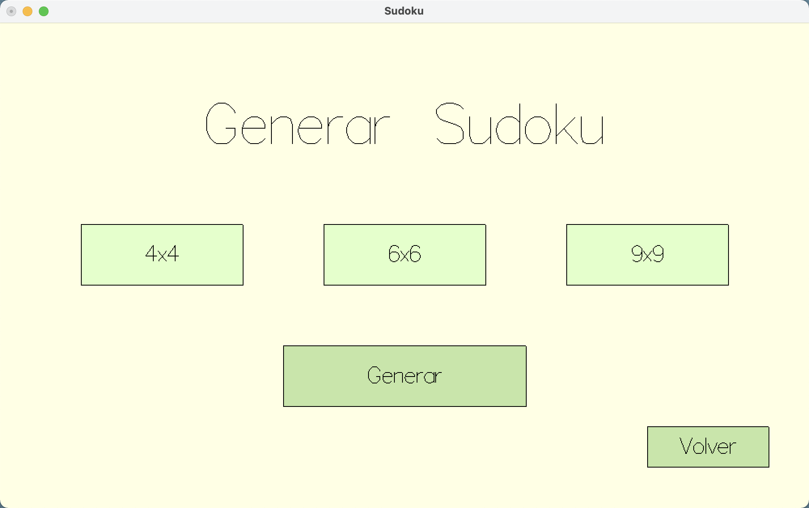
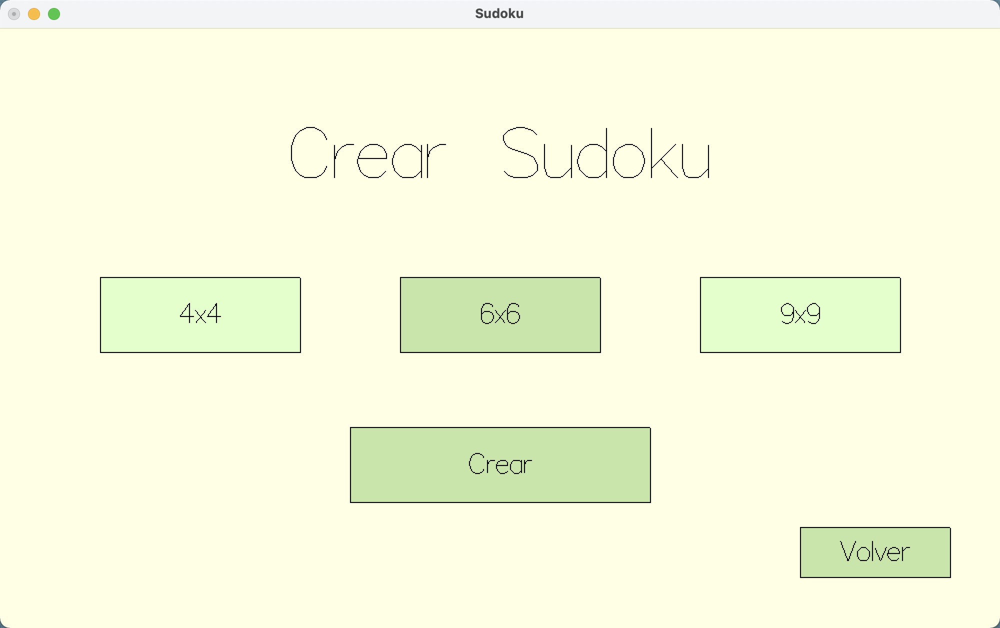
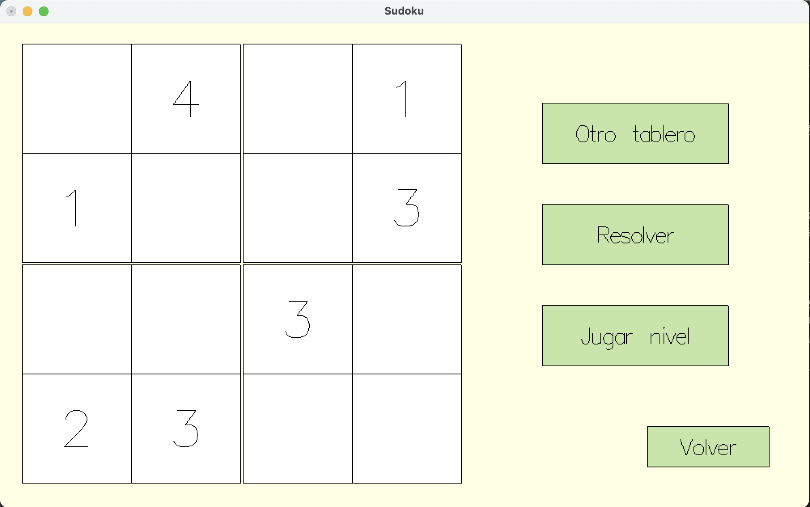
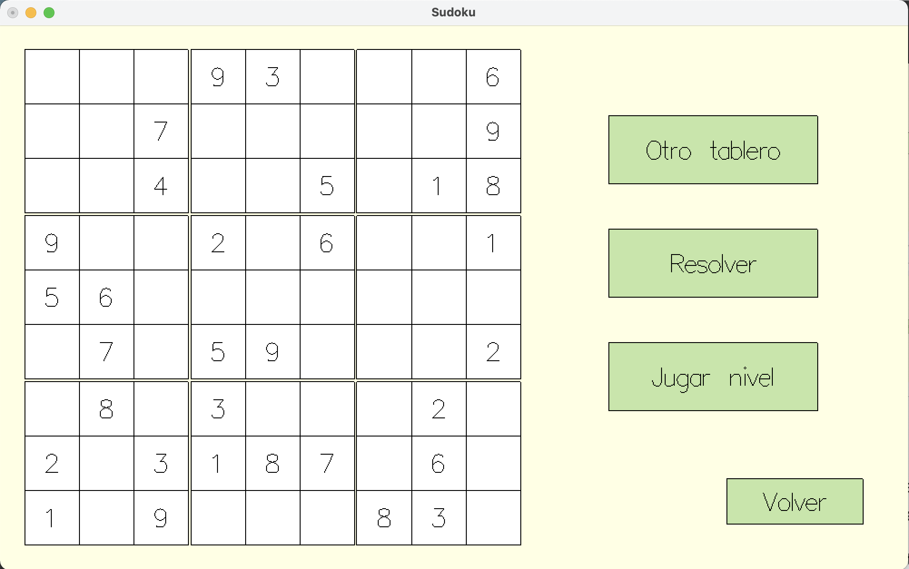
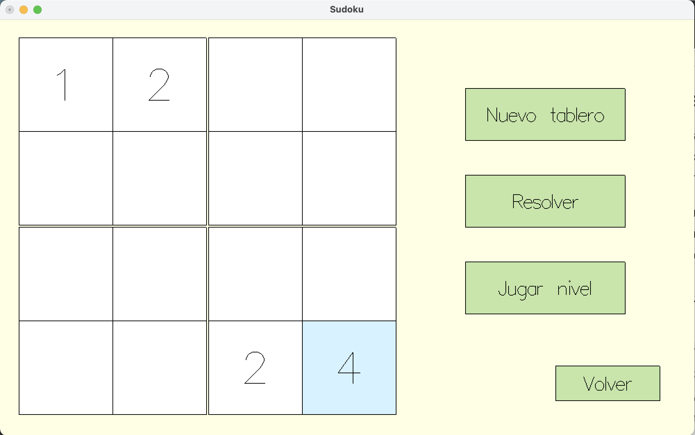
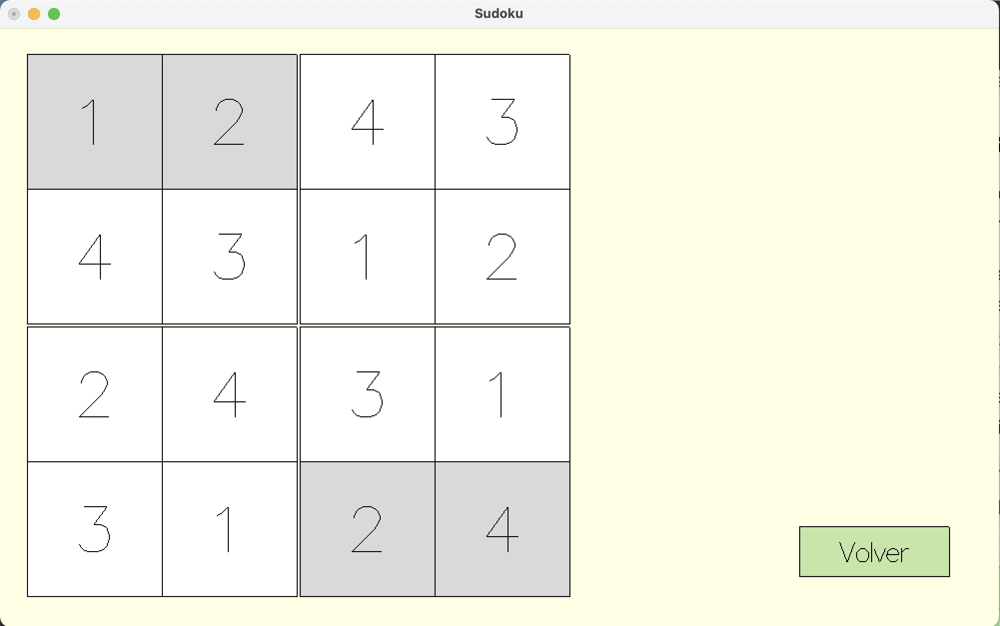
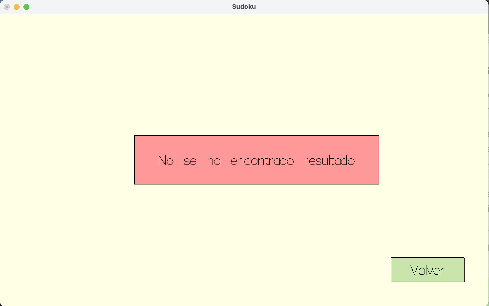
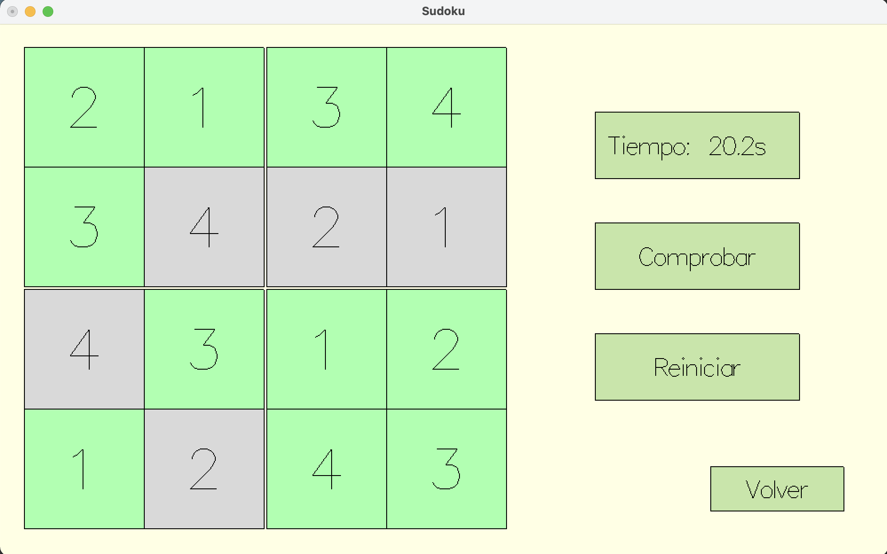
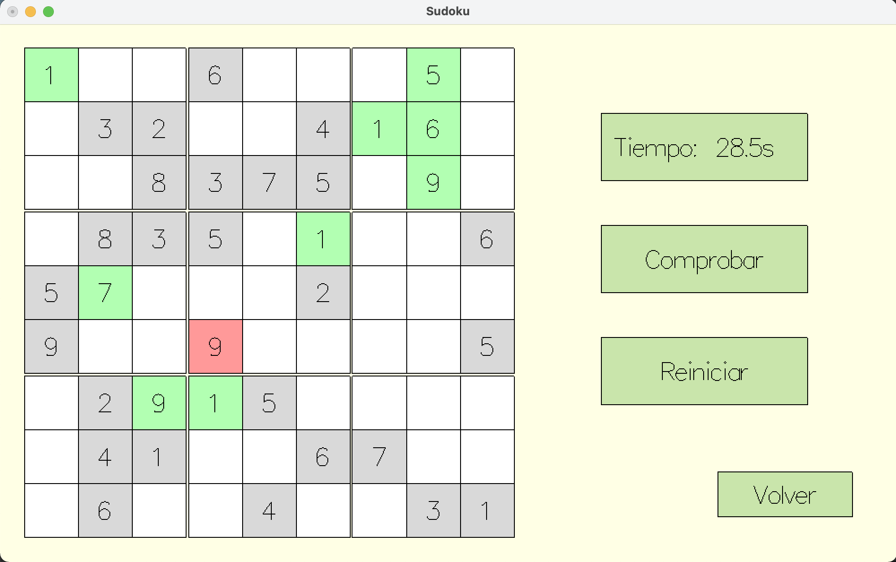

# Sudoku

## Librerías necesarias
Para poder compilar y ejecutar el código hace falta tener descargado la librería gráfica **Gloss** (`cabal install gloss`) y **System.Random** (`cabal install random`) para generar números aleatorios sin necesidad de utilizar semillas. Es necesario tener `cabal` para las instalaciones.

También hemos ejecutado los comandos `cabal install --lib [paquete]` para añadir al entorno las librerías sin tener que cargarlas a mano cada vez que se compile.

Nosotros hemos utilizado un Mac para compilar y ejecutar el programa. Para compilarlo, desde el directorio en el que se encuentra el archivo (o dando la ruta completa) en terminal: `ghc PF_Practica4.hs`. Con ello se crea el ejecutable y se puede ejecutar directamente con `./PF_Practica4`.

## Funcionamiento del programa
Hemos realizado un programa interactivo para el usuario que es capaz de generar tableros de Sudokus y de que el usuario cree su propio tablero. Además, para cualquiera de los dos tipos de tablero, el programa puede tanto resolverlos, como hacer que el usuario juegue a solucionarlo.

  

En cualquiera de las dos opciones se puede elegir la **dificultad del juego**, que es el tamaño del tablero (4x4, 6x6 o 9x9). La opción seleccionada estará marcada con otro color y es necesario tener una opción elegida para crear o generar.

  |   
:-------------:|:---------------:


 |  |  
:-------------:|:---------------:|:---------------:

### Generar Sudoku
Una vez elegida la dificultad se genera un Sudoku con al menos una solución. El usuario puede elegir entre las opciones:
1. **Otro tablero**, que generaría otro tablero de la misma dificultad.
2. **Resolver**, el programa buscaría una solución y se mostraría al usuario. En el caso de que una celda pudiera tomar varios valores, se dejaría la celda en blanco, sin ningún número encima.
3. **Jugar nivel**, el programa llevaría a la interfaz de jugar, donde podrá solucionar el Sudoku generado.

 
 |  |    
:-------------:|:---------------:|:---------------:

<div style="page-break-after: always"></div>

### Crear Sudokus

En esta interfaz, es el usuario quien crea el Sudoku. La dificultad, al igual que en el caso de "Generar Sudoku", viene dado por la dimensión del tablero. Las opciones son:
1. **Nuevo tablero**, que limpia el Sudoku entero.
2. **Resolver**, el programa buscaría si existe solución para el tablero planteado y en caso afirmativo lo mostraría. En el caso de que haya soluciones múltiples, solo se indican las celdas con valor fijo.
3. **Jugar nivel**, el programa verifica que es un tablero con solución y llevaría a la interfaz de jugar, donde se jugaría el nivel creado.

> NOTA: solo se permite introducir números del 1 al n, siendo n la dimensión del Sudoku. En el caso de intentar introducir un caracter o un número mayor el programa lo ignoraría. Para eliminar el dígito de una celda (siempre que no sea uno fijo) se puede eliminar con la tecla Supr, Delete o pulsando el número 0.

Ejemplo creando un tablero con solución única:
 | 
:-------------:|:---------------:

Ejemplo creando un tablero sin solución, al darle a "Resolver" o "Jugar nivel" aparece un aviso:
 | 
:-------------:|:---------------:

<div style="page-break-after: always"></div>

### Jugar Sudokus

El tablero se vuelve interactivo, las pistas se volverán de color gris y no se podrán alterar. Dentro de esta opción:
1. Hay un **indicador del tiempo** que llevamos jugando, en segundos.
2. Se puede **comprobar** el tablero en cualquier momento y se indicarán en rojo las casillas que se repiten con otras bien sea en filas, columnas o regiones; y en verde las que no.
3. Se puede **reiniciar** el nivel, limpiando todas las casillas que no fueran las iniciales y restableciendo el tiempo a 0.

> NOTA: solo se pueden introducir números del 1 al n, al igual que en "Crear Sudoku" y el funcionamiento es el mismo.

 | 
:-------------:|:---------------:

 | 
:-------------:|:---------------:

<div style="page-break-after: always"></div>

## Código interfaz

Se ha utilizado la librería `Gloss` y más concretamente, `Gloss.Interface.Game` . Gloss es muy útil para pintar vectores en 2d, animaciones y simulaciones puesto que utiliza OpenGL. El inconveniente es que no es tan cómodo crear botones y *widgets* y hay que crearlos a mano, como mostraremos a continuación. 

Para empezar, se ha definido el dato `GameState` que indica la página de la interfaz en la que estamos:

```
data GameState = MainMenu | GenMenu1 Int | GenMenu2 Sudoku
    | CreatMenu1 Int | CreatMenu2 Sudoku Selected
    | SolveMenu (Maybe Sudoku) GameState 
    | PlayMenu Sudoku Sudoku Selected Float Bool GameState

data Selected = Maybe (Int, Int)
```
A cada página de la interfaz se pasan unos parámetros diferentes dependiendo de lo que se necesita mostrar. Por ejemplo, `MainMenu` no necesita de ningún parámetro, mientras que  `GenMenu2` tiene el Sudoku generado para mostrarlo por pantalla.

El código para la interfaz se divide a grandes rasgos en:
1. Definiendo "variables":
   - Implementamos un nuevo tipo de dato, `type Bounds = (Float, Float, Float, Float)` que corresponden a las coordenadas de la esquina izquierda superior (coord. x, coord. y), ancho y alto.
   - Hemos definido los `Bounds` de todos los botones que usamos en la interfaz.
   - Hemos definido los colores que usamos en nuestra interfaz (haciendo uso de `(Gloss) makeColor`).

2. Mostrar diferentes páginas: Utilizamos la función `printWorld :: GameState -> IO Picture` que dado un estado del juego se imprime la interfaz correspondiente.
   - Hemos definido previamente los `Bounds` y los colores de los botones para poderlos imprimir desde esta función.
   - Para crear el tablero, hemos implementado una función para visualizar el tablero del Sudoku `paintSudoku`. Pintamos la cuadrícula con la función `paintSudokuField` y añadimos los valores y colores a las casillas con `paintSudokuCell`.


3. Actuar frente a las diferentes acciones: `handleEvents` es una función que se encarga de decidir qué hacer cuando recibe una acción del usuario. `handleEvents :: Event -> GameState -> IO GameState`
   - `Event` conforma las diferentes acciones que pueden ocurrir, desde presionar o soltar una tecla o mover el ratón.
   - Recibe el evento con el estado del juego actual y retorna otro, un `IO GameState`.
   - Para retornar otro estado, llamamos a funciones auxiliares, cada una dedicada a un menú concreto, para organizar mejor el código. Ejemplos de estas auxiliares son: `mainMenuEvent`, `genMenu1Event` o `creatMenu2Event` que reciben un evento, y miran con `inBounds` si se ha clickeado dentro del `Bounds` de un botón.

4. Registrar tiempo de juego. Utilizamos `elapseTime :: Float -> GameState -> IO GameState`, que indica el tiempo que ha transcurrido desde el último frame que se ha enseñado por pantalla y cuando estamos en el menú de jugar incrementamos el tiempo en ese valor.

5. Crear botones: creamos unos *widgets*, que al pulsar en ellas desencadenan ciertas acciones.
   - Con el nuevo tipo, pintamos los rectángulos, utilizando `rectangle`. Está formado por un polígono (`(Gloss) polygon`) relleno al que le pasamos un color (definidos con `(Gloss) makeColor`), unas lineas como contorno (`(Gloss) line`) y un texto que se muestra, dándole además un alineamiento horizontal respecto al botón y tamaño de la letra.
   - Crear los botones: `button`. Se llama a `rectangle` especificando un tamaño de letra.

## Código de la mecánica del juego

### Generar Sudokus
Generamos primero el tablero lleno (para asegurar que tiene al menos una solución) y dejamos un número aleatorio entre el 35% y 45% de pistas. 

Para ello, hemos implementado la función `generate` que se encarga de poner primero todos los 1's en posiciones aleatorias, comprobando que no se repitan por fila, columna ni región. A continuación, los 2's en los huecos restantes, verificando que no se repitan, y así hasta el número n, que corresponde a la dimensión del Sudoku.

Esto lo hacemos llamando a `genField`, que utiliza `genLoop`, que realiza iteraciones intentando meter valores en el tablero. En el caso de que llegados a un punto el tablero no tenga solución, y por tanto no se pueda seguir rellenando, `genLoop` aborta y  `genField` vuelve a llamarlo, para generar un nuevo tablero.

> De media, el 4x4 rara vez falla, el 6x6 falla unas 15 de media con desviación típica 5 y el 9x9, generalmente, entre 1000 y 3000. En cualquier caso, esto es muy rápido y en menos de medio segundo se consiguen obtener todos los tableros.

<div style="page-break-after: always"></div>

### Resolver Sudokus

Utilizamos un método de combinatoria. A cada celda se le asigna una lista con los posibles valores que puede tomar la casilla. Esta información la almacenaremos en el denominado tablero de valores. Inicialmente si el Sudoku tenía una pista en una celda, sus posibles valores es únicamente dicho valor, y si no, los posibles valores serían todos los números.

También se tiene por cada fila, columna y grupo (a partir de ahora denominados conjuntos), una lista de todas las posibles combinaciones de valores que pueden tomar las celdas de estos conjuntos.

El algoritmo consiste en actualizar el tablero de valores a base de analizar todas las combinaciones de todos los conjuntos. Del mismo modo, a medida que las celdas del tablero tienen menos posibles valores, diversas combinaciones tienen que ser descartadas ya que ya no son válidas. Tras varias iteraciones se consigue reducir el tablero y las combinaciones hasta un punto en el que ya se tiene un único valor posible por celda, y una única combinación por conjunto, y por tanto se devuelve la solución obtenida. Es posible que si existen varias soluciones llegue a un punto en el que no se puedan reducir más las combinaciones, por lo que se retornaría las soluciones obtenidas hasta ese momento.

Hemos creado la función `solve` que implementa este algoritmo, que empieza llamando a `solStart` que realiza una sincronización inicial para reducir el tablero de valores dadas todas las posibles combinaciones iniciales del Sudoku. Luego se llama a `solLoop` que realiza en bucle el descartar combinaciones inválidas tras la sincronización anterior, y resincronizar el tablero de nuevo. Una vez no se realicen mas cambios en las sincronizaciones de una iteración del bucle (bien porque se ha llegado a la solución final o se ha llegado a un punto donde no se diferencian más las posibles soluciones), se retorna el resultado.

Si el Sudoku a resolver no tiene solución, llegará un momento en el que el algoritmo dejará a un conjunto sin posibles combinaciones de valores para sus celdas, lo detectará y abortará la ejecución devolviendo `Nothing`.

### Comprobar solución
Utilizamos este método para cuando el usuario quiere comprobar si el tablero con los números introducidos es correcto. Una celda tiene un valor correcto si su valor no se repite en la fila, columna y grupo en la que está. La celda se coloreará de verde si su valor es correcto y rojo si existen conflictos. Las casillas sin número seguirán siendo de color blanco.

Para verificar si el valor de una celda es correcto, obtenemos una lista que represente los valores de las celdas de la fila a la que pertenece, y comprobamos que no se repita su valor en ninguna de estas celdas. Lo mismo para la columna y grupo al que pertenece.

Para colorear el tablero usamos función `colorSudoku` que itera sobre todas las celdas verificando sus valores llamando a la función `colorCell`, al que se le pasan las 3 listas de los valores de las celdas de su misma fila, columna y grupo. Para obtener estas listas, en el caso de filas es fácil ya que el propio Sudoku es una lista de filas, por lo que se puede acceder a la fila directamente, para las columnas hay que usar la transposición de la matriz del Sudoku para acceder directamente a ella, pero para los grupos es mas complejo y se hace uso de las funciones `getGrpsMat` para modificar la matriz y de `pos2grp` para saber a que índice acceder.

<div style="page-break-after: always"></div>

### Código de funciones auxiliares

Hemos definido varias funciones de utilidades, que se mencionan en este apartado ya que no son específicas ni de la mecánica del juego ni de la interfaz, si no que son usadas a lo largo y ancho de todo el programa. Estas funciones están todas debidamente comentadas en el código, pero ejemplos de estas son: `member`, `removeDups`, `getValMat` y `setValMat`, `getGrpsMat`, `fracture`, `size2dim`, entre otros. La mayoría de estas funciones son polimorfas, para poder abstraer el tipo de las mismas y poder usarse en diferentes situaciones, como por ejemplo `createMat`, que se usa en varias ocasiones para crear matrices tanto de `Int`'s, como de `Bool`'s y de `Color`'s.
